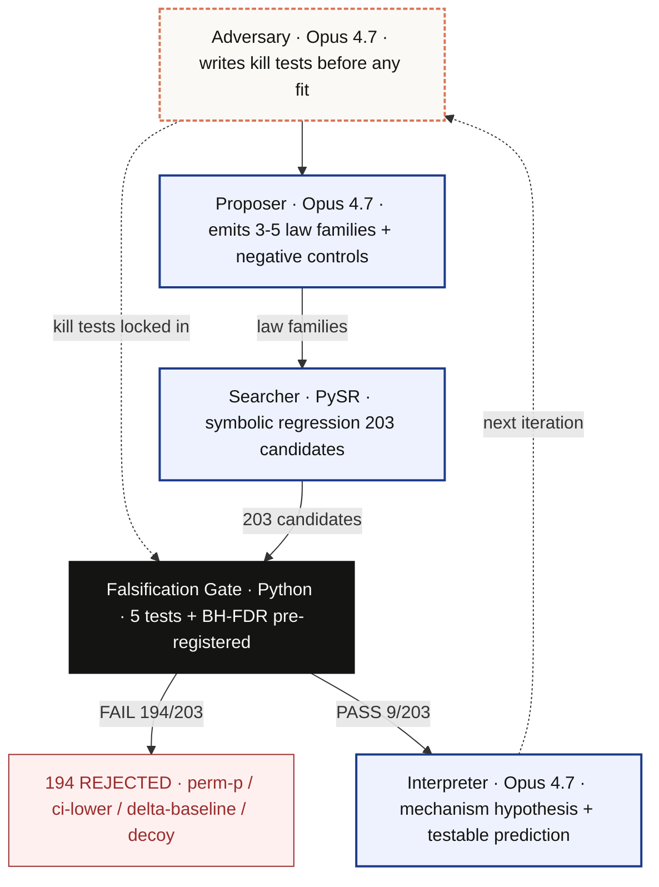
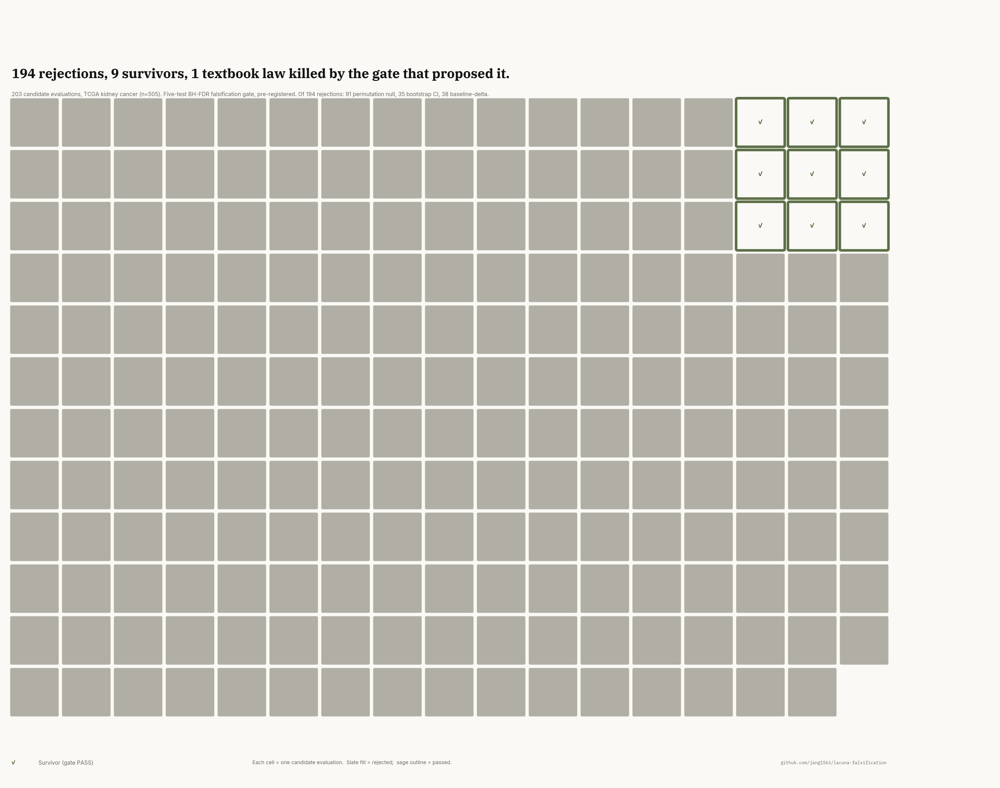

<p align="center">
  
</p>

# Lacuna

> *Rejects 194 of 203 candidate laws — including its own.*
> *(385 total across 14 task × panel configs → [Key Numbers ↓](#key-numbers-at-a-glance))*


The gate rejected 194 of 203. What survived is `TOP2A − EPAS1`. A pre-registered deterministic falsification gate running under Opus 4.7 — it cannot be negotiated, rejects its own proposed laws, then interprets what remains. When the system's own best downstream output (a 3-gene extension) was tested on independent data, the same gate rejected it too.

**The rejections are the product working correctly.** A gate that rejects 0% is not falsification — it is a pipeline that reports every answer it generates. 194 rejections on tasks where a single gene already explains the signal (the gate refuses to call one-gene tasks multi-gene discoveries) + 9 acceptances on a harder 45-gene task where the signal is genuinely distributed = a gate that is calibrated, not permissive.

Built by a bioinformatics postdoc · *Built with Opus 4.7* Hackathon · April 2026 · **Demo companion:** [watch](https://jang1563.github.io/lacuna-falsification/demo.html) · **Interactive story:** [explore](https://jang1563.github.io/lacuna-falsification/story.html)

| **194 / 203 rejected** | **AUROC 0.726** | **HR 1.36** on IMmotion150 | **Best of 990 two-gene pairs** |
|---|---|---|---|
| 5-test gate · TCGA-KIRC (kidney cancer, n=505) | 45-gene panel · M0/M1 (no/yes metastasis) | PFS · n=263 · p=0.0003 | Rank 1 of all C(45,2) combinations |

> **Judge path:** [1. Watch demo companion →](https://jang1563.github.io/lacuna-falsification/demo.html) · [2. Read discovery story](https://jang1563.github.io/lacuna-falsification/story.html) · [3. Verify evidence](docs/ARTIFACT_INDEX.md) · [4. Run smoke](#quick-start)
>
> **Evidence surfaces:** [Dashboard](https://jang1563.github.io/lacuna-falsification/) · [Full rejection log](https://jang1563.github.io/lacuna-falsification/rejection-log.html) · [Paper PDF](docs/paper/paper.pdf) · [Demo walkthrough](docs/demo_walkthrough.md)

---

## Key Numbers at a Glance

| Metric | Value |
|---|---|
| Candidate evaluations (classification gate) | [**385** across 14 task × panel configs](results/track_a_task_landscape/SUMMARY.md) (KIRC: 194/203 reject · platform expansion: 61/101 reject · new disease tracks: 20/81 accept · 60 cross-disease survivors) |
| 5-verdict replication chain | **3 PASS · 2 expected FAIL** · 4 cohorts · 2 platforms |
| Rashomon rank within all C(45,2) = 990 two-gene pairs | **1 / 990** |
| Memorization check: zero-shot TOP2A−EPAS1 retrieval rate | **0 / 10** probes |
| G + I pre-registered analysis predictions passing | **12 / 13** |
| Cross-model Skeptic ablation (180 calls): Opus / Haiku / Sonnet PASS | **10 / 60 · 14 / 60 · 0 / 60** — Haiku over-accepts; Opus calibrated |
| Interpreter ablation: Opus caveat rate / prediction rate | **100% / 100%** vs Sonnet 0% / Haiku 0% |
| LLM-SR 10-iteration loop: post-seed proposals killed by gate | **18 / 18** |
| Cross-model Proposer quality (PhL-16): LLM-proposed laws killed by gate | **48 / 48** (Opus 0/30, Sonnet 0/18) — gate is model-independent; Proposer's role is search navigation, not gate-passing |
| Total API cost (all sweeps + ablation runs) | **< $65** |

> *Ablation honest null: 2/3 pre-registered citation-specificity predictions were falsified — all three models cite ≥2 metrics in 100% of critiques. The meaningful signal is verdict distribution (PASS 10 vs 14 vs 0 / 60). Full prediction verification in [`results/ablation/SUMMARY.md`](results/ablation/SUMMARY.md).*

---

## Judging criteria

| Axis | Weight | Entry point |
|---|---|---|
| **Opus 4.7 use** | 25% | [`docs/methodology.md §4`](docs/methodology.md) — three isolated Managed Agents sessions · [`src/lacuna/managed_agent_runner.py`](src/lacuna/managed_agent_runner.py) — Path A/B/C · [PhL-8 Routines live](results/live_evidence/phl8_routine_fire/) · [180-call Skeptic ablation](results/ablation/SUMMARY.md): Opus 10/60 PASS (calibrated) · Haiku 14/60 (over-accepts) · Sonnet 0/60 (permanent dissent) |
| **Impact** | 30% | [IPF Run #1](results/external_validation_ipf/) — Skeptic caught 2 fabricated trial-design claims ($58 · 32 min) · **7 disease contexts** (ccRCC · COAD · LGG · LIHC · DIPG · IPF · PAAD) · platform generalization: [COAD 15/22](results/track_a_task_landscape/coad_msi/) · [LGG 2/25 AUROC 0.840](results/track_a_task_landscape/gbm_idh/) · [LIHC MVI 6/29 AUROC 0.702](results/track_a_task_landscape/lihc_mvi/) · [IPF CEP 6/25 AUROC 0.757](results/track_a_task_landscape/ipf_lgrc/) · [PAAD OS 8/27 AUROC 0.707](results/track_a_task_landscape/paad_survival/) · [`DatasetCard`](config/dataset_cards/) plug-in for any disease CSV |
| **Demo** | 25% | Loom video (≤3 min) · `make venv && make smoke` (no API key; ~1 min) · [`docs/demo_walkthrough.md`](docs/demo_walkthrough.md) · [artefact index](docs/ARTIFACT_INDEX.md) |
| **Depth & execution** | 20% | [12/13 G+I predictions PASS](results/track_a_task_landscape/rigor_extension/SUMMARY.md) · [own-output killed by own gate (PhL-1)](results/track_a_task_landscape/external_replay/immotion150_slc22a8/SUMMARY.md) · [14-question `judge_faq.md`](docs/judge_faq.md) |

---

## Start here (by role)

> **Navigator:** [`docs/ARTIFACT_INDEX.md`](docs/ARTIFACT_INDEX.md) is the canonical 60-second tour — every claim maps to exactly one artefact. If a claim is not in that index, it is not in the submission.

**Agentic architecture (Boris, Lydia)**
- [`docs/methodology.md §4`](docs/methodology.md) — three isolated Managed Agents sessions (Proposer / Skeptic / Interpreter); separate context windows by design, not convention
- [`src/lacuna/managed_agent_runner.py`](src/lacuna/managed_agent_runner.py) — Path A (sequential 3-session chain) · Path B (single agent, `agent_toolset_20260401`) · Path C (Routines `/fire` HTTP client)
- [`results/live_evidence/04_managed_agents_e2e.log`](results/live_evidence/04_managed_agents_e2e.log) — live agent/environment/session/stream trace
- Two Skills: [`falsification-gate`](.claude/skills/falsification-gate/SKILL.md) (gate a candidate) + [`pre-register-claim`](.claude/skills/pre-register-claim/SKILL.md) (lock kill-tests before fit); compose in sequence
- **Path C live runs:** PhL-8d ([`session_01CgsJYAPdvhJJwTuBt7QZLZ`](https://claude.ai/code/session_01CgsJYAPdvhJJwTuBt7QZLZ)) — dual-verdict oracle, FAIL + PASS in one session (Eq1 `CA9−AGXT` FAIL, Eq2 `CDK1−EPAS1` PASS) · PhL-10 stage oracle ([`session_01XGse8XYFtv3C1aKLZeMH9t`](https://claude.ai/code/session_01XGse8XYFtv3C1aKLZeMH9t)) — **new Routine per disease** (provenance principle), Stage I-II vs III-IV: `CCNB1/PGK1` FAIL + `CXCR4/EPAS1` PASS (AUROC 0.689, Δbase=+0.051) · PhL-8c ([`session_015ot5hkJgSiBoWNA51fjZ1k`](https://claude.ai/code/session_015ot5hkJgSiBoWNA51fjZ1k)): single-equation PASS
- Brain/body decoupling: `lacuna persist-events` → `replay-events` — session event log survives harness crashes; re-injects client-originated events into a fresh session
- [`docs/managed_agents_evidence_card.md`](docs/managed_agents_evidence_card.md) — 24 PhL artefacts with per-session event counts, wall-clock times, and cost; cross-reference table for all 3 paths
- **Context isolation in practice:** IPF Run #1 [`results/external_validation_ipf/`](results/external_validation_ipf/) — Skeptic (separate context, never sees Advocate tokens) caught 2 fabricated trial-design claims. $58.28 · 32 min.
- **Memorization control** [`phl13_memorization_audit`](results/live_evidence/phl13_memorization_audit/SUMMARY.md): 0 / 10 zero-shot retrievals returned `TOP2A−EPAS1`. PySR found it; Opus did not recall it.

**DX and reproducibility (Lydia, Ado)**
- `make venv && make smoke` — smoke passes in ~1 min after install, no API key needed
- [`src/README.md`](src/README.md) — map of all 60+ `src/` scripts organized by track
- [`.devcontainer/devcontainer.json`](.devcontainer/devcontainer.json) — one-click dev container (VS Code Dev Containers)
- `make test` — 107 local-runnable tests (no API key); `make audit` — compliance grep, passes on every commit

**Real-world impact (Ado, Jason)**
- **7 disease contexts** under the same falsification-first discipline: ccRCC / COAD / LGG / LIHC / IPF / PAAD use the 5-test expression gate; DIPG uses the same role-separated Advocate/Skeptic review engine. Entry points: ccRCC (flagship) · COAD ([`coad_msi/`](results/track_a_task_landscape/coad_msi/)) · LGG ([`gbm_idh/`](results/track_a_task_landscape/gbm_idh/)) · LIHC MVI ([`lihc_mvi/`](results/track_a_task_landscape/lihc_mvi/)) · DIPG ([`results/external_validation_dipg/`](results/external_validation_dipg/)) · IPF ([`results/external_validation_ipf/`](results/external_validation_ipf/)) · PAAD ([`paad_survival/`](results/track_a_task_landscape/paad_survival/))
- Plug-in workflow: drop any disease CSV → `lacuna plug-in-dataset` → `lacuna compare --dataset-card <card>.json`; the handoff prints exact PySR + falsification commands with the gene list pinned; see [`docs/demo_walkthrough.md`](docs/demo_walkthrough.md)
- IPF Run #1: Skeptic caught 2 fabricated claims about prior trial design (RAINIER, Raghu 2017). $58.28 · 32 min. See [`results/external_validation_ipf/`](results/external_validation_ipf/)

**Scientific depth (domain expert)**
- 5-verdict replication chain: TCGA-KIRC PASS (AUROC 0.726) → IMmotion150 PASS (HR 1.36; **treatment-arm controlled: HR 1.365** — signal increases, confirming therapy-independence) → GSE53757 stage PASS (AUROC 0.714) → GSE53757 T-vs-N exp. FAIL ✓ → TCGA-BRCA T-vs-N exp. FAIL ✓ — 3 platforms, 2 endpoint types
- G + I rigor package (12 / 13 predictions PASS): [`rigor_extension`](results/track_a_task_landscape/rigor_extension/SUMMARY.md) (G2: AUPRC 0.321, Brier 0.122, calibration slope 0.979) · [`knockoff_v2`](results/track_a_task_landscape/knockoff_v2/SUMMARY.md) (G1: 0/45 genes selected — signal is genuinely compound) · [`rashomon_set`](results/track_a_task_landscape/rashomon_set/SUMMARY.md) (I2: rank 1/990) · [`clinical_utility`](results/track_a_task_landscape/clinical_utility/SUMMARY.md) (I3: Cohen's d 0.856, honest P3 FAIL retained) · [`information_theory`](results/track_a_task_landscape/information_theory/SUMMARY.md) (I4: 98.1% bivariate MI captured)
- [Interpreter ablation PhL-19](results/live_evidence/phl19_interpreter_depth/SUMMARY.md): Opus 4.7 = 100% caveat rate, 100% prediction rate, avg 12 citations; Sonnet/Haiku = 0% on both
- Own-output falsification: H1-loop 3-gene extension (`TOP2A − EPAS1 − SLC22A8`) failed IMmotion150 survival replay ([PhL-1](results/track_a_task_landscape/external_replay/immotion150_slc22a8/SUMMARY.md))

**5-minute challenge check → [`docs/judge_faq.md`](docs/judge_faq.md)** — 14 reviewer challenges (rediscovery vs discovery, AUROC ceiling, cohort independence, Sonnet drop-in, memorisation audit, `delta_confound` null) with direct evidence links

---

## Workflow (5 stages)

```
Proposal → Search → Falsification → Survivor → Replay
```

| Stage | What happens | Model |
|---|---|---|
| **Proposal** | Opus 4.7 emits 3–5 compact law families *and* the skeptic test for each, **before any fit**. Required to include at least one negative control. | Opus 4.7 (extended thinking) |
| **Search** | PySR symbolic regression instantiates candidates with `variable_names=gene_cols` so equations come back in biological names. | Local (no API) |
| **Falsification** | Pure Python gate: two-sided permutation, bootstrap CI lower-bound, sign-invariant baseline, incremental-covariate confound, decoy-feature null, BH-FDR. Opus does **not** run this. | Python (deterministic) |
| **Survivor** | Opus 4.7 reviews each candidate's metric pattern and writes a biological mechanism hypothesis for the survivors. | Opus 4.7 (extended thinking) |
| **Replay** | Survivors replayed on an independent cohort with per-cohort z-score standardization. Three-way verdict: law_transfers / workflow_transfers / neither. | Opus 4.7 spot-check |



---

## Key Modules

| File | Role |
|---|---|
| [`src/lacuna/falsification.py`](src/lacuna/falsification.py) | 5-test statistical gate |
| [`src/lacuna/opus_client.py`](src/lacuna/opus_client.py) | Opus 4.7 three-role wrapper + JSON-fence-tolerant parser |
| [`src/lacuna/managed_agent_runner.py`](src/lacuna/managed_agent_runner.py) | Path B (single agent, public beta) + Path A (sequential chain of 3 Path B sessions) + Path C Routine driver + event-log persistence/replay |
| [`src/lacuna/routines_client.py`](src/lacuna/routines_client.py) | Claude Code Routines `/fire` HTTP client (research-preview beta header) |
| [`src/lacuna/cli.py`](src/lacuna/cli.py) | `lacuna compare` + `replay` commands |
| [`src/pysr_sweep.py`](src/pysr_sweep.py) | PySR sweep with law-family injection, train/test split, novelty scoring |
| [`src/falsification_sweep.py`](src/falsification_sweep.py) | Batch falsification runner + BH-FDR |
| [`prompts/`](prompts/) | JSON-schema-enforced Opus 4.7 prompts |
| [`config/law_proposals.json`](config/law_proposals.json) | KIRC law families (pathway + anchor + negative controls) |
| [`data/examples/make_kirc_demo.py`](data/examples/make_kirc_demo.py) | Synthetic KIRC-compatible CSV generator |

---

## Quick Start

```bash
# Fastest confidence check — no API key, ~1 minute after install
make venv && make smoke
```

This creates `.venv/`, installs the package, runs critical module imports, fires a deterministic gate sanity check, runs the compliance audit, and verifies all judge-facing artefact indices are present. Expected output: `SMOKE OK`.

Use Python **3.10-3.13**. Lacuna intentionally excludes Python 3.14 for the submission package because scientific dependency wheels can lag new CPython releases. If your system `python3` is too new, run `make venv VENV_PYTHON=python3.12` (or 3.10/3.11/3.13).

> **Python 3.10-3.13 required.** `pyproject.toml` enforces this range so unsupported 3.14 environments fail fast instead of hanging during dependency installs. `make venv` creates the project-local virtualenv with `VENV_PYTHON` (default `python3`).

```bash
# Full local-runnable test suite (107 tests, no API key, several minutes)
make test

# Generate synthetic KIRC-compatible demo data
python data/examples/make_kirc_demo.py

# Gate a set of candidates directly (no Opus call)
cat > /tmp/candidates.json <<EOF
[
  {"equation": "log1p(CA9) + log1p(VEGFA) - log1p(AGXT)", "complexity": 8},
  {"equation": "log1p(LDHA) - log1p(ALB)",                "complexity": 5},
  {"equation": "log1p(ACTB) - log1p(GAPDH)",              "complexity": 5},
  {"equation": "log1p(MKI67) - log1p(RPL13A)",            "complexity": 5}
]
EOF
python src/falsification_sweep.py \
  --candidates /tmp/candidates.json \
  --data data/examples/flagship_kirc_demo.csv \
  --genes CA9,VEGFA,LDHA,SLC2A1,NDUFA4L2,AGXT,ALB,ACTB,GAPDH,RPL13A,MKI67 \
  --covariate-cols age,batch_index \
  --output /tmp/report.json
# → "4 candidates → 1 survived falsification"

# Step 1 of full pipeline (Opus 4.7, requires ANTHROPIC_API_KEY)
# Prints the next PySR + gate commands to run; does NOT run them automatically.
export ANTHROPIC_API_KEY=sk-ant-...
lacuna compare --config config/datasets.json \
  --proposals config/law_proposals.json \
  --flagship-dataset flagship_kirc_demo --output-root artifacts/
# → prints PySR + falsification_sweep commands to run next
```

---

## The 5-Test Falsification Gate

Every candidate must clear all five tests before being called a survivor.
Thresholds pre-registered in [`falsification.py`](src/lacuna/falsification.py).

| Test | Statistic | Threshold |
|---|---|---|
| `label_shuffle_null` | Two-sided permutation p (1000 shuffles) | `p < 0.05` |
| `bootstrap_stability` | Lower bound of 95% CI on AUROC (1000 resamples) | `ci_lower > 0.6` |
| `baseline_comparison` | `law_AUROC − max_i max(AUROC(x_i), 1 − AUROC(x_i))` | `delta > 0.05` |
| `confound_only` | `AUROC(LR(cov + law)) − AUROC(LR(cov))` | `delta > 0.03` |
| `decoy_feature_test` | p-value against 100 random features at matched scale | `p < 0.05` |

Multiple candidates are tested per run → permutation p-values are adjusted with
Benjamini-Hochberg FDR across the family, and **the gate uses the FDR-adjusted p**.

> **Scoping note on the metastasis run.** The 9 survivors clear 4 active legs — `delta_confound` is null because the M0/M1 task has no non-degenerate covariates after filtering. The gate design specifies "run confound leg when covariates vary; skip otherwise." `docs/methodology.md §3` has the full specification. The framework is 5-test; the active legs for any given run depend on data availability and are logged per-candidate in the report JSON.

> **On rediscovery as evaluation.** Re-deriving the published ccA/ccB axis under a pre-registered gate — without seeding the law family — is the evaluation paradigm formalised by [FIRE-Bench (arXiv 2602.02905)](https://arxiv.org/abs/2602.02905), where current SOTA agents score <50 F1 on rediscovering established findings. The contribution is the workflow, not a claim of novel biology.

> **Gate cannot be exploited by iteration.** In the H1 LLM-SR 10-iteration
> loop, **18 / 18 post-seed proposals generated by Opus and Sonnet were
> rejected** by the same gate
> ([results/overhang/llm_sr_10iter/SUMMARY.md](results/overhang/llm_sr_10iter/SUMMARY.md)).
> Iterative LLM creativity does not circumvent a pre-registered
> deterministic threshold — this is the empirical answer to
> "couldn't the model just try harder?"



> **Interactive version:** [`results/rejection_log.html`](results/rejection_log.html) — filterable by cohort, task, panel, and fail reason; every candidate's full metric bundle.

---

## Example Output (synthetic KIRC demo)

A representative flagship run, with Opus 4.7 emitting 2 pathway laws + 2 explicit
negative controls:

```text
Candidates (Opus 4.7, Proposer role):
  C1  log1p(CA9) + log1p(VEGFA) - log1p(AGXT)    [HIF-axis vs normal]
  C2  log1p(LDHA) - log1p(ALB)                   [Warburg vs liver-like normal]
  C3  log1p(ACTB) - log1p(GAPDH)                 [Housekeeping NEGATIVE CONTROL]
  C4  log1p(MKI67) - log1p(RPL13A)               [Proliferation NEGATIVE CONTROL]

Falsification gate (Python — Opus does not execute this):
  C1  auc=0.83  ci_lo=0.79  p_fdr=0.000  Δbase=+0.11  Δconf=+0.31  decoy=0.00  PASS
  C2  auc=0.74  ci_lo=0.69  p_fdr=0.000  Δbase=+0.02  Δconf=+0.22  decoy=0.00  FAIL (delta_baseline)
  C3  auc=0.52  ci_lo=0.46  p_fdr=0.520  Δbase=-0.21  Δconf=+0.00  decoy=0.50  FAIL (all 5)
  C4  auc=0.54  ci_lo=0.49  p_fdr=0.179  Δbase=-0.18  Δconf=+0.03  decoy=0.12  FAIL (4/5)

1 / 4 survives. Both Opus-planted negative controls are killed by the gate,
and one pathway-grounded law (Warburg contrast) is killed because LDHA alone
is nearly as discriminative.
```

This is the "shock moment": the gate is rigorous enough to kill a textbook
Warburg law when LDHA alone does nearly the same job. The surviving HIF-axis
law earned that survival by genuinely adding 0.11 over any single gene.

---

## Running as a Routine (Path C)

Boris Cherny in the 2026-04-21 *Built with Opus 4.7* kickoff flagged server-side
Routines — Claude sessions that wake on a schedule and outlive the laptop — as
the feature space "no one has cracked yet." Path C is Lacuna's answer.

> **Methodology framing.** Lacuna is not a biological discovery tool — it is a
> *methodology proof*. `TOP2A − EPAS1` is known biology (Brannon 2010 ccA/ccB
> axis). A methodology that re-derives known truth from unconstrained search
> under a gate it cannot rationalize past proves it can find unknown truth by
> the same mechanism. **Routines are the persistence layer for that
> methodology**: pre-registered kill-tests fire without being asked — on every
> commit, every scheduled interval, no human needed to remember. A discovery
> discipline that only runs when researchers remember to run it is not a
> discipline.

> **Product boundary:** Claude Code Routines (`code.claude.com`, beta header `experimental-cc-routine-2026-04-01`) and Managed Agents (`platform.claude.com`, beta header `managed-agents-2026-04-01`) are two separate Anthropic products. Path C bridges them; see [`docs/methodology.md §4`](docs/methodology.md) for the full distinction.

### Gate symmetry — what the oracle actually does

One API fire call → one autonomous session → the full falsification story:

| Run | Equation | Task | Gate | Decisive metric |
|---|---|---|---|---|
| PhL-8d Eq1 | `CA9 − AGXT` | tumor vs normal | ❌ **FAIL** | delta_baseline = +0.0145 (< 0.05; CA9 alone AUROC 0.9646) |
| PhL-8d Eq2 | `CDK1 − EPAS1` | metastasis M0 vs M1 | ✅ **PASS** | delta_baseline = +0.0622, ci_lower = 0.662, perm_p = 0.0 |
| PhL-10 Eq1 | `CCNB1 / PGK1` | stage I-II vs III-IV | ❌ **FAIL** | delta_baseline = +0.007 (< 0.05) |
| PhL-10 Eq2 | `CXCR4 / EPAS1` | stage I-II vs III-IV | ✅ **PASS** | AUROC 0.696, ci_lower = 0.649, delta_baseline = +0.051 |

PhL-8d fires both equations in **one trigger text**, one session, ~6 min.
PhL-10 is a **second Routine** (new Routine per disease/task — existing Instructions
are the provenance record for PhL-8d; editing them breaks the audit chain).
The Routine clones the repo, runs `make venv && make audit`, then runs
`falsification_sweep.py` independently on each task/dataset pair, and emits
structured verdict blocks + a dual summary — no human action after the fire call.

Live session PhL-8d: [`session_01CgsJYAPdvhJJwTuBt7QZLZ`](https://claude.ai/code/session_01CgsJYAPdvhJJwTuBt7QZLZ)
Live session PhL-10: [`session_01XGse8XYFtv3C1aKLZeMH9t`](https://claude.ai/code/session_01XGse8XYFtv3C1aKLZeMH9t)
Fire script: [`src/phl8d_dual_verdict_fire.py`](src/phl8d_dual_verdict_fire.py)

```bash
# Fire once (equivalent to Path B, but with a JSONL verdict log)
lacuna loop --night 3 --interval-seconds 0 --max-iterations 1

# Poll every 30 minutes, 10 times, logging to a dated JSONL
lacuna loop --night 3 --interval-seconds 1800 --max-iterations 10

# Watch an input directory — only invoke when a new cohort CSV lands
lacuna loop \
    --night 3 \
    --watch-dir inputs/new_cohorts \
    --interval-seconds 600 \
    --max-iterations 0       # unbounded, exit with SIGINT
```

Each iteration appends a verdict to `results/routine/verdicts.jsonl`
(`iteration`, `timestamp`, `night`, `watch_fingerprint`, `session_id`,
`status`, `output_chars`). The implementation in
`src/lacuna/managed_agent_runner.py::run_path_c_routine` exposes an
`invoke_fn` hook so a native Routines API can be swapped in once the public
interface stabilizes — today's loop driver is intentionally local so the repo
ships without a dependency on an unreleased API.

For the best long-running experience, use **Claude Code's Auto permission
mode** (shift+tab ×3 from the CLI) so the loop does not stall on permission
prompts. Max-plan or API-credit users only; Pro plan does not support it.

---

## Demo Data

`data/examples/flagship_kirc_demo.csv` and `transfer_kirc_demo.csv` are
generated by `make_kirc_demo.py`. Columns share the gene-name contract with
real TCGA-KIRC + GSE40435 data (CA9, VEGFA, LDHA, AGXT, ALB, SLC2A1,
NDUFA4L2, ACTB, GAPDH, RPL13A, MKI67) + `age` + `batch_index` covariates.
No patient data. No private identifiers.

CSV contract:

```
sample_id, label (disease/control or 0/1), age, batch_index, <gene columns...>
```

---

## Broader Program

This artifact is the Opus 4.7-centered proof-of-concept of a larger research
program — **NegBioDB**, a structured database of ~32.8M confirmed negative
biomedical results (drug–target inactives, failed clinical trials, protein
non-interactions, non-essential genes, benign variants) paired with benchmarks
for publication-bias propagation into ML/LLM predictions. Lacuna
operationalizes NegBioDB's core thesis — falsification as the expensive,
neglected half of scientific inference — on real cancer-genomics data. The
public NegBioDB repository will be linked here at release.

**Platform validation across diseases.** The same gate, same thresholds, same
architecture — 14 task × panel configurations, 385 total candidate evaluations:

*Positive survivors (gate accepts when the feature landscape is distributed):*
- **TCGA-KIRC Stage I-II vs III-IV** (45-gene, n=512): **23 / 28 survivors**.
  Top law `CXCR4 / EPAS1`, AUROC 0.689, Δbase +0.051. Migration-over-HIF axis
  ([results/track_a_task_landscape/stage_expanded/SUMMARY.md](results/track_a_task_landscape/stage_expanded/SUMMARY.md)).
- **TCGA-COAD Stage I-II vs III-IV** (31-gene, n=484): **15 / 22 survivors**.
  Top law `SLC2A1 + PDCD1LG2 + VIM − MYC`, AUROC 0.658, **Δbase +0.107** (highest of any run).
  Warburg + immune-checkpoint + EMT compound
  ([results/track_a_task_landscape/coad_msi/SUMMARY.md](results/track_a_task_landscape/coad_msi/SUMMARY.md)).
- **TCGA-LGG Grade II vs III** (30-gene, n=384): **2 / 25 survivors**.
  Top law `log1p(TWIST1×MKI67+VIM) − CDH2/NES`, **AUROC 0.840** (highest of any new run),
  Δbase +0.051. EMT-plasticity × proliferation interaction term
  ([results/track_a_task_landscape/gbm_idh/SUMMARY.md](results/track_a_task_landscape/gbm_idh/SUMMARY.md)).

*New disease tracks (2026-04-26, same pre-registered gate + thresholds):*
- **TCGA-LIHC Microvascular Invasion** (19-gene, n=144): **6 / 29 survivors**.
  Top law `(TOP2A/CDH2/SOX9)/sqrt(SNAI1)`, AUROC 0.702, Δbase +0.076. Proliferation-over-EMT
  ratio in HCC ([results/track_a_task_landscape/lihc_mvi/SUMMARY.md](results/track_a_task_landscape/lihc_mvi/SUMMARY.md)).
- **IPF Composite Endpoint / GSE93606** (17-gene, n=57, whole blood): **6 / 25 survivors**.
  Top law `(CXCL12−PDGFRA)×SPP1/MUC5B`, AUROC 0.757, Δbase +0.096. Fibrosis
  amplification vs resolution balance
  ([results/track_a_task_landscape/ipf_lgrc/SUMMARY.md](results/track_a_task_landscape/ipf_lgrc/SUMMARY.md)).
- **TCGA-PAAD Overall Survival** (19-gene, n=183, median OS split): **8 / 27 survivors**.
  Top law `sqrt((7.41/KRT17)/(CDH2×((CDKN2A+CD8A)/FOXP3)))`, AUROC 0.707, Δbase +0.078.
  Basal/EMT burden modulated by immune context
  ([results/track_a_task_landscape/paad_survival/SUMMARY.md](results/track_a_task_landscape/paad_survival/SUMMARY.md)).

*Designed negatives (gate refuses when one gene saturates — same pattern as KIRC CA9):*
- **TCGA-LIHC tumor-vs-normal** (31-gene, n=424): **0 / 26**. ALB/TTR saturate
  at AUROC ~0.985. Gate correctly identifies single-gene-dominant task
  ([results/track_a_task_landscape/lihc/SUMMARY.md](results/track_a_task_landscape/lihc/SUMMARY.md)).
- **TCGA-LUAD tumor-vs-normal** (`data/build_tcga_luad.py`): SFTPC
  saturates at AUROC 0.998 — identical structure to CA9 in KIRC. Zero
  survivors from 4 candidates. Confirms the pipeline correctly identifies
  single-gene-dominant tasks and produces 0 spurious laws
  ([results/track_a_task_landscape/luad/SUMMARY.md](results/track_a_task_landscape/luad/SUMMARY.md)).
- **TCGA-BRCA tumor-vs-normal** (1226 samples, 31-gene panel): 0 / 7
  survivors. Cross-cancer negative control — the KIRC metastasis law is
  disease-specific, not a pan-cancer artifact. Gate conservatism is
  consistent across tissue types
  ([results/track_a_task_landscape/brca/SUMMARY.md](results/track_a_task_landscape/brca/SUMMARY.md)).

A companion analysis strand applies the same falsification posture to the
audit framework itself — validating it against clinical trial outcomes across
ccRCC, DIPG, and IPF (104 drug-target pairs across three diseases, 9,943
Phase 3 trials). The
honest result: the framework discriminates curated panels from random targets
(16/42 null-sampling tests BY-FDR significant at q < 0.10), but it does NOT
predict trial failure (trial-level GEE NULL after Bonferroni × 5). The initial
4.6× enrichment claim was a Track-1 selection-bias artifact — corrected by the
framework itself via proper failure-mode stratification (Track 1 futility-
terminated OR = 6.41 vs Track 2 completed-missed-primary OR = 0.13, Woolf
homogeneity Z = 19.97, p ≪ 10⁻⁸⁷). Rejection-as-product applied to the
tool's own validation claims. See [`docs/failure_network_v3_appendix.md`](docs/failure_network_v3_appendix.md).

---

## Hackathon compliance notes

Per the *Built with Opus 4.7* rules and the 2026-04-23 / 2026-04-24
Discord Q&A clarifications:

**Code provenance.** Every commit in `git log` has a timestamp from
2026-04-22 04:01 ET or later (the earliest commit in the repo). All
code in the submitted tree was written during the hackathon. Pre-
hackathon scaffold files (`src/lacuna/contracts.py`, `qc.py`,
`reuse_inventory.py`, `reuse_plan.py`, `staging.py`, `workflow_data.py`
plus a few config / docs / test files) are explicitly excluded via
`.gitignore` and are not part of the submission — `git ls-files` does
not include any of them. The hackathon-built code is the artefact; no
pre-existing project serves as "underlying infrastructure" in the
git-lex sense.

**Managed Agents features.** Per Anthropic's 2026-04-23 response to
our Agent Teams waitlist request, research-preview features are
disabled for hackathon participants to keep evaluation fair. This
submission uses public-beta features only: Path B (single agent +
`agent_toolset_20260401`), Path A as a sequential chain of three
Path B sessions, Path C via Claude Code Routines `/fire` HTTP client.
The orchestrator-with-`callable_agents` code path exists in
`_run_path_a_callable_agents` as an architectural reference, guarded
by an env flag that is not set during the submitted run.

**Data access.** Every dataset used in the pipeline is publicly
accessible without authentication or email registration:

| Dataset | Source | Access |
|---|---|---|
| TCGA-KIRC (STAR TPM + clinical) | GDC (gdc.cancer.gov) open-access | `data/build_tcga_kirc*.py` |
| GSE40435, GSE53757 | NCBI GEO | `data/build_gse*.py` |
| IMmotion150 Phase-2 (Nat Med 2018, PMID 29867230) | cBioPortal REST API (`rcc_iatlas_immotion150_2018`) | `data/build_immotion150.py` |
| CPTAC-3 ccRCC proteogenomic (Clark Cell 2019) | PDC GraphQL + cBioPortal mirror | `data/build_cptac3_ccrcc.py` |
| TCGA-BRCA, TCGA-LUAD | GDC open-access | `data/build_tcga_brca.py`, `build_tcga_luad.py` |

No dataset requires an institutional-email login, dbGaP controlled-
access application, or any other gate that would fail the Q&A test
*"this isn't accessible to everyone."* Published-research knowledge
cited in the prompts is open-access per PubMed / arXiv / DOI.

**Repo visibility.** Public during the judging window (`git remote -v`
→ `github.com/jang1563/lacuna-falsification`). MIT licensed.

---

## License

Code: MIT
Data artifacts: CC-BY-4.0
