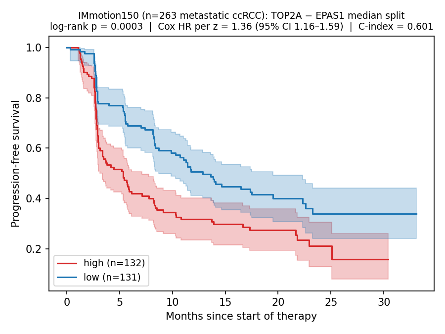

# Abstract

Scientific AI discovery loops are often optimized to surface positives; failed hypotheses disappear. We present Lacuna, a falsification-first law-discovery loop where the rejection log is primary. In the original TCGA-KIRC campaign, a pre-registered five-test classification gate rejected 203/203 initial candidate evaluations, including a CA9-dominated HIF/tubule-identity contrast with AUROC 0.984 because CA9 alone reached 0.965 and the compound added only +0.019 AUROC. Each rejection is traced to a gate test and failure class. The decisive repair target was panel absence: the 11-gene panel contained MKI67 but lacked TOP2A/CDK1-like cell-cycle anchors and broader proliferation/EMT context. After repairing only that cause, the same classification gate accepted 9/30 metastasis candidates, led by `TOP2A - EPAS1` (AUROC 0.726), a two-gene projection of the published proliferation/ccB versus HIF2alpha/ccA axis. This survivor reduced, but did not eliminate, memorization concern: Opus 4.7 did not retrieve it zero-shot in 10 probes. Externally, the score passed a pre-registered IMmotion150 cross-endpoint prognostic replay (n=263; HR=1.36; C=0.601; p=0.00027), while CPTAC-3 M-stage replay preserved direction but failed the gate. The same external survival gate then rejected the loop's own `SLC22A8` extension. Lacuna turns failure into mechanism: reject, diagnose, repair the named cause, and let locked gates kill weak repairs.

# 1 Introduction

Most AI-for-science loops are designed to find something. An LLM proposes a plausible hypothesis, a search routine fits candidates, a report highlights the highest number, and the failed hypotheses quietly vanish. That workflow scales the oldest scientific failure mode: confirmation bias. The problem is not that automated discovery systems sometimes fail; it is that the failure often leaves no structured artifact.

Lacuna inverts the artifact. The unit of evidence is a rejection log: every candidate law receives a deterministic gate verdict, a `fail_reason`, and a bounded failure class. Positive findings matter only after the rejection machinery has had a chance to kill them.

This paper is written for the Failure Modes in AI setting. Its contribution is not a new kidney-cancer pathway. The flagship survivor, `TOP2A - EPAS1`, is best understood as a compact two-gene projection of the published clear-cell renal cell carcinoma (ccRCC) proliferation/ccB versus HIF2alpha/ccA axis. The contribution is procedural: a loop that rejects plausible but non-incremental laws, diagnoses a named failure cause, repairs only that cause, recovers a known biological axis under the unchanged classification gate, and then rejects its own downstream extension on an external survival gate.

We make four claims aligned to the workshop criteria.

1. **Operational failure definitions.** Lacuna uses three traced failure classes in the main text: saturation, tubule dominance, and panel absence.
2. **Reproducible triggers.** Each class maps to a gate test and threshold, especially the sign-invariant `baseline_comparison` test.
3. **Trace-level diagnostics.** We show the actual rejected CA9-dominated trace and the accepted `TOP2A - EPAS1` trace, including `fail_reason`.
4. **Verified mitigation.** Only one class is claimed as repaired: panel absence. Expanding the panel yields 9/30 accepted metastasis candidates under the same five-test classification gate.

# 2 Lacuna Architecture

Lacuna separates proposal, search, judgment, and interpretation. LLMs may suggest law families and write skeptical tests, but the pass/fail decision is made by deterministic code.

| Role | Function | Failure controlled |
|---|---|---|
| Proposer | Writes compact biological law families and ex-ante skeptic tests. | Unstructured search and missing negative controls. |
| Symbolic search | PySR searches equations over a fixed gene panel. | Manual cherry-picking of equations. |
| Gate | Python evaluates pre-registered thresholds and records `fail_reason`. | LLM-as-judge rationalization. |
| Skeptic | Reviews numeric gate outputs and caveats. | Narrative overclaiming after a gate run. |
| Interpreter | Interprets only survivors. | Mechanism prose for failed candidates. |

## 2.1 The Five-Test Classification Gate

The internal TCGA-KIRC discovery gate is a five-test classification gate. The same gate is used for the original rejection layer and the 45-gene panel repair. External survival replay uses a different three-test gate; we do not collapse those under one "same gate" phrase.

| Test | Statistic | Threshold |
|---|---|---|
| `label_shuffle_null` | Two-sided permutation p-value | p < 0.05, FDR adjusted |
| `bootstrap_stability` | Lower 95% bootstrap CI on AUROC | ci_lower > 0.60 |
| `baseline_comparison` | Law AUROC minus best sign-invariant single-gene AUROC | delta > 0.05 |
| `confound_only` | Incremental AUROC over available covariates | delta > 0.03 when non-degenerate covariates exist |
| `decoy_feature_test` | p-value against random matched-scale decoys | p < 0.05 |

The baseline comparison is the load-bearing test. It prevents the loop from reporting a multi-gene "discovery" when a single feature already explains the task. A gene with raw AUROC below 0.5 can still be a strong classifier after sign inversion, so the baseline is sign-invariant.

Each candidate row records metrics, pass/fail status, and a comma-separated `fail_reason`. An empty `fail_reason` is required for a classification-gate survivor.

## 2.2 Accounting Lock

The original rejection layer and the panel-repair layer are separate campaigns. The denominator is therefore locked as follows:

| Layer | Candidate set | Count | Verdict accounting | Paper wording |
|---|---:|---:|---|---|
| Original rejection layer | 11-gene HIF-axis panel, four tasks plus Opus ex-ante templates | 203 | 203 rejected / 0 accepted | "203 initial candidate evaluations were rejected." |
| Repaired metastasis layer | 45-gene expanded metastasis panel | 30 | 21 rejected / 9 accepted | "After a panel repair, 9/30 metastasis candidates passed the same five-test classification gate." |
| Combined internal classification campaign | Initial plus repaired layers | 233 | 224 rejected / 9 accepted | Use only when this table is shown. |

# 3 Case Study: From Rejection Trace to Panel Repair

This section is the paper's FMAI core: it makes failure operational, shows the trigger that fired, gives trace-level examples, and then tests one repair. All TCGA-KIRC AUROC values in this section are discovery-cohort gate metrics. They are not independent clinical validation, and they are not a deployment-ready risk model.

## 3.1 Original Rejection Layer

Across four ccRCC tasks on the original 11-gene HIF-axis panel, every task produced zero survivors. The task-level searches account for 140 candidate rows; the full initial rejection layer contains 203 candidate evaluations after including Opus ex-ante templates.

| Task | n | Dominant gene, sign-invariant AUROC | Candidates tested | Survivors | Failure class |
|---|---:|---|---:|---:|---|
| Tumor vs normal | 609 | CA9, 0.965 | 33 | 0 | Saturation |
| Stage I-II vs III-IV | 534 | CUBN, 0.610 | 34 | 0 | Tubule dominance |
| Five-year survival | 301 | CUBN, 0.696 | 36 | 0 | Tubule dominance |
| Metastasis M0 vs M1 | 505 | MKI67, 0.645 | 37 | 0 | Panel absence |

These are not four versions of the same failure. Tumor-normal is saturated by CA9. Stage and survival are dominated by kidney tubule-identity signal. The metastasis task fails for a different reason: the original panel contains MKI67 but lacks TOP2A/CDK1-like cell-cycle anchors and broader proliferation/EMT context.

## 3.2 Operational Failure Classes

For the main text we keep the taxonomy to three traced classes. A fourth "noise/overfit" class remains appendix-only unless a concrete exemplar trace is included.

| Failure class | Operational trigger | Observable trace | Demonstrated mitigation status |
|---|---|---|---|
| Saturation | A single feature is already near the task ceiling, so `delta_baseline <= 0.05` even when the compound AUROC is high. | `fail_reason` includes `baseline_comparison`; dominant gene AUROC is close to law AUROC. | Diagnosed and bounded; not repaired here. |
| Tubule dominance | A kidney tubule-identity gene dominates a stage or survival endpoint, preventing compact compound laws from clearing baseline comparison. | Dominant genes such as CUBN define the sign-invariant baseline. | Diagnosed and bounded; not repaired here. |
| Panel absence | The panel lacks the axes required for the biological contrast. | The metastasis panel includes MKI67 but lacks TOP2A/CDK1-like anchors and broader proliferation/EMT context. | Verified: expanding the panel produced 9/30 survivors. |

This framing is intentionally narrow. Lacuna does not claim that every failure class has a verified fix. The demonstrated repair is panel absence only.

## 3.3 Trace-Level Examples

The rejection log is the evidence surface. A high AUROC is insufficient if the candidate fails the incremental baseline test.

| Trace | Task | Candidate | Key metrics | `fail_reason` | Verdict |
|---|---|---|---|---|---|
| Rejection | Tumor vs normal | `log1p(CA9) + log1p(VEGFA) - log1p(AGXT)` | AUROC 0.984; CA9 baseline 0.965; delta +0.019 vs required +0.050 | `baseline_comparison` | FAIL |
| Acceptance | M0 vs M1, expanded panel | `(0.09855198 * (TOP2A - EPAS1)) + 0.16059029` | AUROC 0.726; baseline 0.657; delta +0.069; CI lower 0.658; permutation p=0.0; decoy p=0.0 | empty | PASS |

The rejected trace is a CA9-dominated HIF/tubule-identity contrast: visually strong, biologically plausible, and still not an incremental discovery. The accepted trace shows the desired behavior: the same classification gate accepts a compact law only after the named failure cause has been repaired.

## 3.4 Repair and Known-Axis Interpretation

The panel repair expanded the metastasis search from the original 11-gene HIF-axis panel to a 45-gene panel with cell-cycle, proliferation, EMT, angiogenesis, and kidney-identity context. Under the unchanged five-test classification gate, 9/30 PySR candidates passed. The survivor family was concentrated: five laws were variants of `TOP2A - EPAS1`, two used `MKI67 - EPAS1`, and two were larger five-gene compounds that did not improve on the two-gene form.

We interpret `TOP2A - EPAS1` as a compact projection of a known ccRCC biology axis, not a newly discovered pathway. TOP2A marks a proliferation/ccB-like pole; EPAS1 marks a HIF2alpha/ccA-like pole. That the loop recovered this axis from symbolic search supports face validity of the method. It does not prove novelty or clinical utility.

The memorization audit reduces one obvious objection. In ten zero-shot probes asking Opus 4.7 for a compact two-gene ccRCC metastasis law, `TOP2A - EPAS1` appeared 0/10 times, and no proliferation-HIF family appeared in top or runner-up slots. When shown the result, the model recognized the relevant literature anchor. The safest interpretation is modest: the pair was not simple zero-shot retrieval in this assay, but this does not prove absence of memorization.

## 3.5 Boundary Evidence

Two negatives keep the repair from becoming a broad generalization claim. In TCGA-BRCA tumor-vs-normal, `TOP2A - EPAS1` reached AUROC 0.978 but failed because the best single gene reached 0.969, leaving only +0.009 delta_baseline. In CPTAC-3 ccRCC M0 vs M1, direction was preserved but the endpoint-matched replay failed: AUROC 0.683, CI lower 0.542, and delta_baseline -0.007 because TOP2A alone reached 0.691. These failures are part of the result, not exceptions to hide.

# 4 External Replay and Self-Kill

## 4.1 IMmotion150 Cross-Endpoint Prognostic Replay

The `TOP2A - EPAS1` score was discovered on TCGA-KIRC M0-vs-M1 classification. IMmotion150 tests a different endpoint: progression-free survival in metastatic ccRCC patients treated in a randomized trial context. This is cross-endpoint prognostic replay, not external validation of the M-stage classifier.

| Survival replay test | Threshold | Observed | Verdict |
|---|---|---|---|
| Log-rank, median split | p < 0.05 | p = 0.00027, chi2 = 13.26 | PASS |
| Cox HR per z-score | High-score worse-PFS direction, HR > 1.3, CI excludes 1 | HR = 1.36, 95% CI 1.16-1.59, p = 0.0001 | PASS |
| Harrell C-index | > 0.55 | 0.601 | PASS |

High-score patients had median PFS 5.35 months; low-score patients had median PFS 12.88 months. We describe this as descriptive PFS separation, not as a treatment-effect claim.

## 4.2 Confounding and Scope

The PFS association survives treatment-arm adjustment. The univariate HR is 1.361; adding treatment arm gives HR 1.365; adding treatment plus log(TMB) on the n=158 subset gives HR 1.293 with p=0.024. The sunitinib arm shows the same pattern as the atezolizumab arms. The safe claim is therefore treatment-arm-adjusted prognostic signal, not ICI-specific biomarker and not treatment-effect prediction.

## 4.3 Evidence Bundle and Honest Negatives

| Cohort | Endpoint | Platform | n | Verdict | Use |
|---|---|---|---:|---|---|
| TCGA-KIRC | M0 vs M1 | RNA-seq | 505 | PASS: AUROC 0.726, delta_baseline +0.069 | Discovery gate accept |
| IMmotion150 | PFS stratification | RNA-seq | 263 | PASS: HR 1.36, C-index 0.601, log-rank p=0.00027 | Cross-endpoint prognostic replay |
| CPTAC-3 ccRCC | M0 vs M1 | RNA-seq/proteogenomic | 155 | FAIL: AUROC 0.683, ci_lower 0.542, delta_baseline -0.007 | Endpoint-matched negative |
| GSE53757 | Stage I-II vs III-IV | Microarray | 72 tumors | PASS: AUROC 0.714, CI [0.584, 0.832] | Cross-platform stage signal |
| GSE53757 | Tumor vs normal | Microarray | 144 | FAIL: best single-gene AUROC 0.9954, delta_baseline -0.724 | Expected saturation |
| TCGA-BRCA | Tumor vs normal | RNA-seq | 1226 | FAIL: delta_baseline +0.009 | Expected cross-cancer negative |

This table is not a claim that the score generalizes across all cancers or all endpoints. It is a mixed evidence bundle: positive replay where the endpoint is prognostic, and negative replays where a locked gate refuses overclaiming.

## 4.4 Self-Kill: SLC22A8 Extension

After the two-gene survivor, the loop proposed a three-gene extension: `TOP2A - (EPAS1 + SLC22A8)`. It improved TCGA-KIRC within-cohort AUROC slightly, but the correct test was whether it survived the same external survival replay gate used for the two-gene form.

| Test | Observed | Verdict |
|---|---|---|
| Log-rank | p = 0.117 | FAIL |
| Cox HR per z-score | HR = 1.16, CI 0.99-1.37, p = 0.074 | FAIL |
| Harrell C-index | 0.566 | PASS |

Overall verdict: FAIL, with 2/3 tests failing. Compared with the two-gene form, C-index dropped from 0.601 to 0.566 and HR dropped from 1.36 to 1.16. This is the loop killing its own best downstream guess under a locked external gate.

# 5 Model Specificity and Agent Behavior

The deterministic gate is necessary but not sufficient. The same numeric evidence can produce different LLM critique behavior depending on the model and inference mode. We therefore treat model specificity as a small audit, not a causal explanation of pretraining or RLHF.

## 5.1 Six-Candidate Cross-Model Audit

The audit used 180 calls: 3 models x 6 candidates x 10 repeats. Opus 4.7 ran without the unsupported thinking mode for this endpoint; Sonnet 4.6 and Haiku 4.5 ran with thinking enabled.

| Model | PASS calls out of 60 | Dissent on gate-PASS candidates | Inference mode |
|---|---:|---:|---|
| Claude Opus 4.7 | 10 | 66.7% | no thinking |
| Claude Haiku 4.5 | 14 | 53.3% | thinking |
| Claude Sonnet 4.6 | 0 | 100.0% | thinking |

All three models cited at least two metrics in every critique, falsifying the pre-registered prediction that weaker models would cite fewer metrics. Metric citation is necessary but not sufficient for calibrated verdicts. Under available inference modes, model identity changed gate-alignment behavior; the causal mechanism is not identified.

## 5.2 Supporting Audits

An Opus 4.6 vs 4.7 audit found no strict miscalibration in either model (0/60 each). The difference was graded abstention: the clean `TOP2A - EPAS1` survivor was PASS 7/10 for Opus 4.6 and 10/10 for Opus 4.7, while the five-gene stress test became less over-accepted by 4.7. This is exploratory evidence, not a leaderboard claim.

In a zero-shot proposer assay, models proposed compact two-gene laws for TCGA-KIRC metastasis. Opus produced 30 valid proposals, Sonnet 18, and Haiku 0; none passed the gate. With the 10-iteration LLM-SR loop, approximately 66 consecutive LLM-proposed compact laws were rejected across model and iteration settings. The finding supports gate binding and format compliance: direct LLM proposing did not rediscover the flagship survivor.

Interpreter-depth results were also model-specific. On three survivors, Opus produced caveated mechanism prose with downstream predictions in 100% of cases, with mean 12 citations and 5.3 pathway mentions. Sonnet and Haiku did not produce caveats or predictions under the same prompt. Because no blind human-rating rubric was completed, this is structure/caveat/prediction discipline, not proof of interpretation correctness.

# 6 Rigor Beyond AUROC

The survivor is not presented as a clinical model. We therefore report additional checks that either support the compact signal or constrain its claims.

| Check | Result | Interpretation |
|---|---|---|
| Robustness axes | Passes threshold grid, permutation stability, bootstrap seed variance, feature scaling, and n=200 subsample; weak against LR pair-with-interaction | Compactness and falsification, not AUROC ceiling, are the contribution. |
| Five-fold CV | AUROC 0.722 +/- 0.078; permutation null 0.509 | Consistent with discovery-cohort gate value. |
| AUPRC/calibration | AUPRC 0.321 vs prevalence 0.156; Brier 0.122; calibration slope 0.979; intercept -0.032 | Risk-stratification signal is calibrated under OOF Platt scaling. |
| Knockoff v2 | 0/45 genes selected at q=0.10; EPAS1 and TOP2A rank #1/#2 by W-stat | Supports compound framing but individual-gene FDR did not select genes. |
| Rashomon set | `TOP2A - EPAS1` rank 1/990; tight epsilon=0.02 set has 3 pairs | Near-optimal two-gene differences share proliferation-minus-EPAS1 structure. |
| Clinical utility | OR per 1-SD 2.07; Cohen's d 0.856; top-quintile sensitivity 0.456 and specificity 0.847 | Fails pre-registered standalone screening cutoff. |
| Information theory | Joint MI 1.82x max individual; compactness 92-98%; synergy CI includes 0 | Compact pair captures most bivariate information; synergy is uncertain. |
| Anchor regression | TOP2A and EPAS1 coefficient directions stable across TCGA-KIRC and IMmotion150 | Tests platform/patient-selection heterogeneity within ccRCC, not broad context transfer. |

The failed clinical-utility gate is important. The top-quintile sensitivity target was 0.50 and observed sensitivity was 0.456; specificity target was 0.85 and observed specificity was 0.847. This makes the score a risk-stratification signal for a multi-marker workflow, not a standalone screening test.

# 7 Lessons for Scientific Agent Design

First, a scientific loop needs a negative product. If failed candidates disappear, the system cannot distinguish "we found nothing" from "we forgot what we killed." Lacuna treats rejection traces as durable outputs.

Second, failure classes have to be operational rather than literary. "The model failed to generalize" is too vague. "The candidate failed `baseline_comparison` because CA9 alone reached 0.965 AUROC and the compound added +0.019" is actionable.

Third, repair should target the named cause. The loop did not change thresholds after the 11-gene panel failed. It repaired panel absence by expanding the panel and reran the same classification gate.

Fourth, rediscovery can be a valid benchmark when framed honestly. Recovering a published ccA/ccB axis from symbolic search is not novel biology, but it is a useful positive-control case for a discovery loop. LLM-SRBench motivates the memorization concern; PhL-13 reduces that concern without pretending to eliminate it.

Fifth, self-kill is harder than first-pass rejection. The SLC22A8 extension was attractive because it improved the original cohort slightly. The external survival gate made the cost visible and rejected it.

# 8 Discussion and Limitations

Lacuna sits between several adjacent lines of work. POPPER provides automated hypothesis validation with sequential falsification testing and statistical error control; Lacuna focuses earlier, on discovery-loop failure definitions and trace-level diagnostics. AI Scientist-style systems automate hypothesis generation, experimentation, and writing; Lacuna is narrower and less autonomous, but its judgment function is deterministic and pre-registered. Biomedical multi-agent systems such as AI co-scientist and BioMedAgent scale biomedical hypothesis and workflow execution; Lacuna targets claim governance inside such loops. FIRE-Bench evaluates whether agents can rediscover established findings; our ccA/ccB recovery is a positive-control instance of that paradigm. LLM-SR and LLM-SRBench motivate the symbolic-regression and memorization sides of the work.

The main limitations are equally important. The flagship biology is rediscovery, not a novel mechanism. The TCGA-KIRC metrics are post-selection discovery-cohort metrics. IMmotion150 is cross-endpoint prognostic replay, not endpoint-matched M-stage validation. CPTAC-3 is the endpoint-matched negative and must stay visible. The score has not been evaluated as part of a full clinical risk model with standard covariates, and TRIPOD+AI/PROBAST+AI-complete reporting is deferred. The model-specificity audit has only six candidates and available inference modes differed across models, so it cannot identify a causal mechanism for model behavior. The verified mitigation is only panel absence; saturation and tubule dominance are diagnosed and bounded, not repaired here.

The broader claim is therefore conservative: Lacuna demonstrates a failure-first pattern for scientific AI loops. It gives failures names, ties names to gate traces, repairs one named cause, and preserves the right to kill its own repair.

# Code, Demo, and Reproducibility

Repository: <https://github.com/jang1563/lacuna-falsification>  
Demo companion: <https://jang1563.github.io/lacuna-falsification/demo.html>  
Interactive story: <https://jang1563.github.io/lacuna-falsification/story.html>  
Rejection log: <https://jang1563.github.io/lacuna-falsification/rejection-log.html>

Primary evidence files are listed in `docs/ARTIFACT_INDEX.md` and the corresponding `results/` subdirectories.

# References

- Brannon AR, et al. "Molecular stratification of clear cell renal cell carcinoma by consensus clustering reveals distinct subtypes and survival patterns." *Genes Cancer.* 2010. PMID 20871783.
- Brooks SA, et al. "ClearCode34: a prognostic risk predictor for localized clear cell renal cell carcinoma." *European Urology.* 2014. DOI 10.1016/j.eururo.2014.02.035.
- McDermott DF, et al. "Clinical activity and molecular correlates of response to atezolizumab alone or in combination with bevacizumab versus sunitinib in renal cell carcinoma." *Nature Medicine.* 2018. PMID 29867230.
- Huang L, et al. "TOP2A expression predicts aggressive clinical outcomes in renal cell carcinoma." 2024. PMID 38730293.
- POPPER: "Automated Hypothesis Validation with Agentic Sequential Falsifications." arXiv:2502.09858.
- "The AI Scientist-v2: Workshop-Level Automated Scientific Discovery via Agentic Tree Search." arXiv:2504.08066.
- "Evaluating Sakana's AI Scientist: Bold Claims, Mixed Results, and a Promising Future?" arXiv:2502.14297.
- "FIRE-Bench: Evaluating Agents on the Rediscovery of Scientific Insights." arXiv:2602.02905.
- "LLM-SR: Scientific Equation Discovery via Programming with Large Language Models." arXiv:2404.18400.
- "LLM-SRBench." arXiv:2504.10415.
- "When AI Co-Scientists Fail: SPOT -- a Benchmark for Automated Verification of Scientific Research." arXiv:2505.11855.
- TRIPOD+AI and PROBAST+AI reporting and risk-of-bias guidance for AI prediction models.
